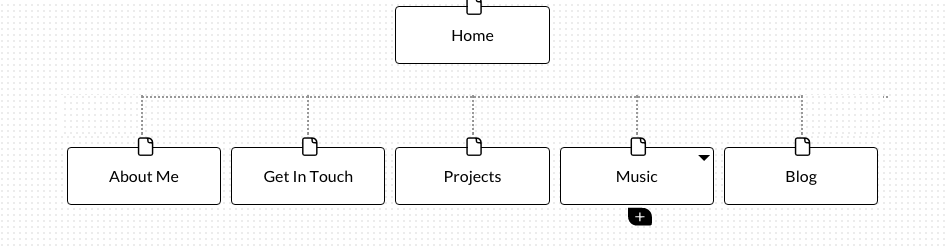

#What are the 6 Phases of Web Design?

The six phases of web design are information gathering, planning, design, development, testing and delivery, and maintenance.

#What is your site's primary goal or purpose? What kind of content will your site feature?

My site's primary goal is to showcase my technical projects and relevant blog posts. It is also to provide my information about me to potential employers such as contact information and a breif biography. My site will feature links to GitHub repos, technical blog posts, contact information, and some passion projects/personal interests such as music or design.

#What is your target audience's interests and how do you see your site addressing them?

My target audience is cheifly potential employers who are interested in knowing if I might be a good fit on their team. I hope to address them professionally while also converying a sense of my personality and interests. I hope to be able to communicate who I am and what I know.

#What is the primary "action" the user should take when coming to your site? Do you want them to search for information, contact you, or see your portfolio? It's ok to have several actions at once, or different actions for different kinds of visitors.

I am most interested in users looking at projects I am working on via GitHub and then following up to contact me. Information and blog posts should be viewed as supplemental information that helps lend a personal quality to the other content.

#What are the main things someone should know about design and user experience?

Design and user experience are closely linked in determining the usability of a site and its ability to effectively accomplish its goal. Design extends beyond the look of a site but rather refers to its structure and how that structure reinforces the goals of the site and how it connects to its audience. User experience can be described as the sum of impressions and encounters a user has while interacting with a site. User experience cannot be measured quantitatively but rather must be assed on a qualitative level. Effective attention to user experience includes user-centric design principles and testing-based evaluation.

#What is user experience design and why is it valuable?

User experience design is an effort to design sites that create value for the user and that are easy and pleasant to use. User experience design is important because the experience a user has on a site determines how likely they are to visit again as well as how effective a site is in accomplishing its intended goals, whether that be to inform or to sell something. User experience design seeks to create sites based on user-centric design principles and to evaluate success qualitatively through methods like A/B testing and surveys.

#What parts of the challenge did you find most tedious?

I found the article on user experience design to be a bit repetitive. Although I believe it is important to be user-centric when it comes to designing and developing sites, surely no one would design a site to be deliberately frustrating or difficult to use. Perhaps it is because I have some experience in basic UX principles like A/B testing and surveys but the revelatory tone of the article made for fairly dull reading.