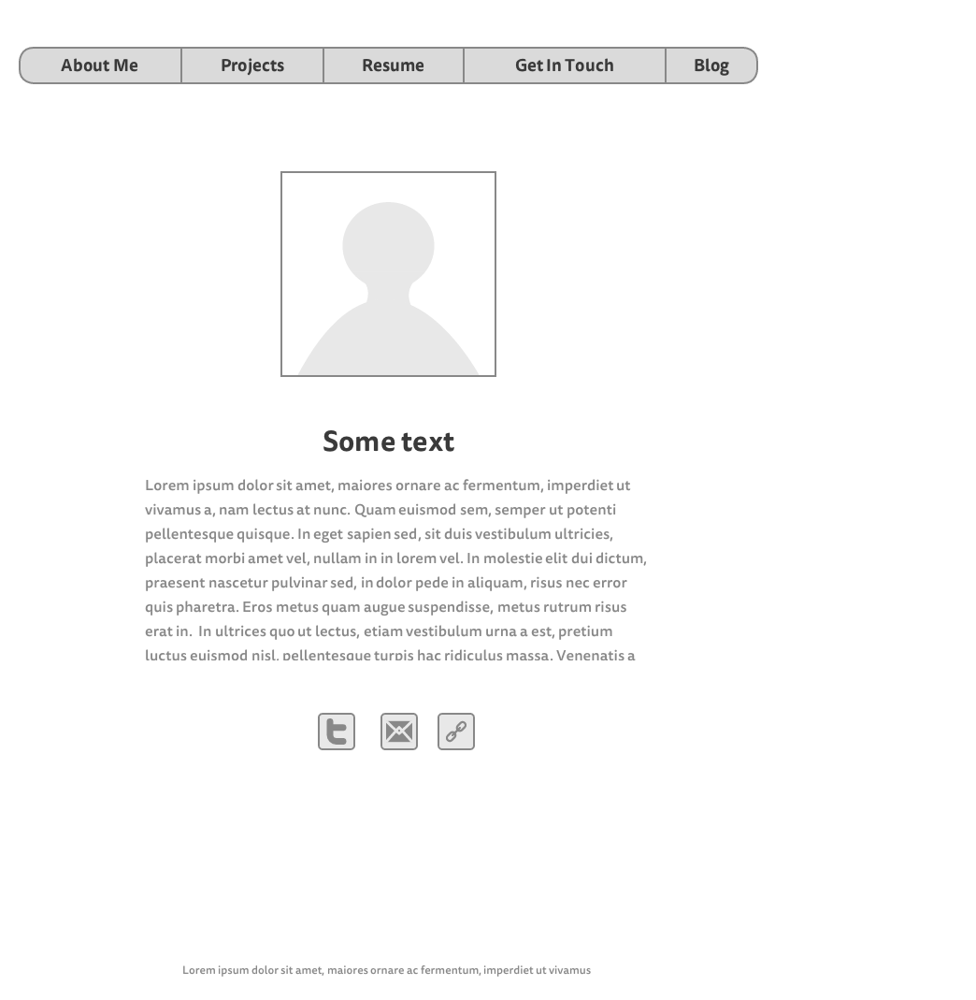
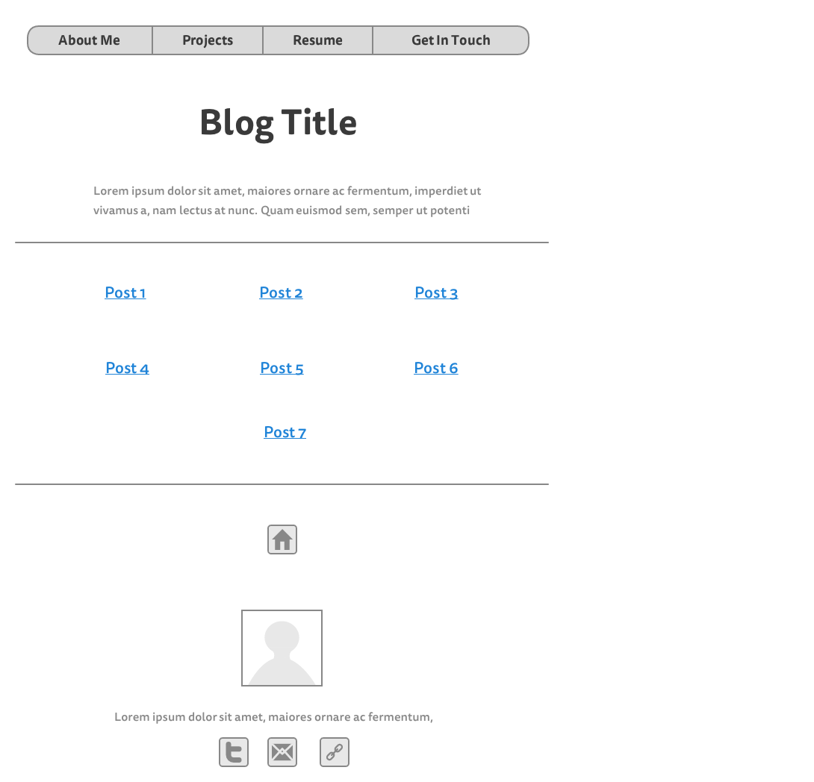

#What is a wireframe?
A wireframe is a tool used in the planning stages of creating a site. A wireframe allows one to define the hierarchy of a site and plan the layout of information. A wireframe is like a skeleton of the site - it may not contain any content inteded for the final site but it allows the designer to plan the layout of the site and its pages.

#What are the benefits of wireframing?
Wireframing allows one to plan the layout of the site and to begin the process of thinking about how users will interact with the site. Wireframing also allows teams or clients to agree upon the look and features of a site before development work has begun. Wireframing allow one to predict or suggest how users will interact with the site based on its design.

#Did you enjoy wireframing your site?
I did enjoy wireframing my site as I greatly enjoy the design process however the constant agonizing over alignments did remind me of particularly terrible design reposonibilities I had in another life.

#Did you revise your wireframe or stick with your first idea?
I largely stuck with my first idea where constituent elements were concerned however I did play with their location and alignment a great deal before settling on something I like.

#What questions did you ask during this challenge? What resources did you find to help you answer them?
At first, I was unable to determine how to delete an element in the Mockingbird wireframe editor. I googled the issue and was met with a litany of results on "To Kill a Mockingbird". A few boolean search operators later and I was able to find a google forum where someone had a similar issue. Embarassingly, I merely had to hit the delete key with an element highlighted.

#Which parts of the challenge did you enjoy and which parts did you find tedious?
I like a fairly minimalist design aesthetic so I enjoyed the task of communicating everything I had to in my index page with as few elements as possible while still maintaining focus on my core ojective for the site. The process of paring down everything but the bare essentials was an interesting one and forced me to think about what would be truly useful or appealing for the user. I found the meticulous positioning of elements to be tedious but I needed everything to be aligned to the grid before I could move on!