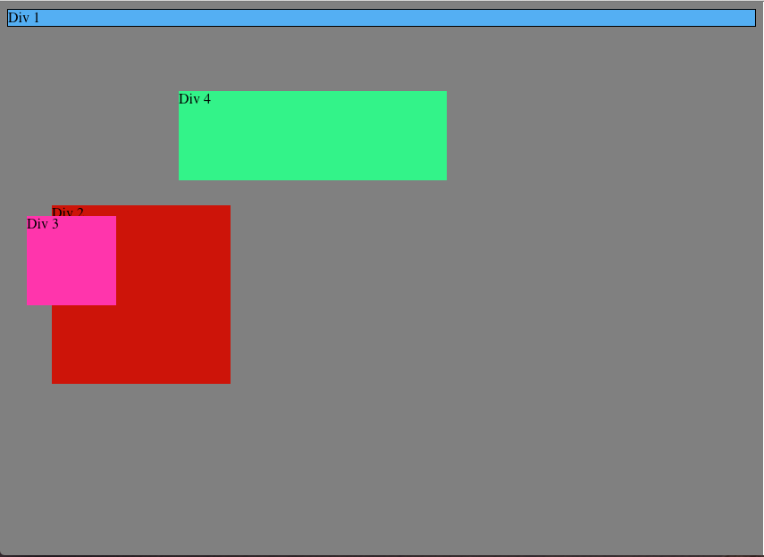
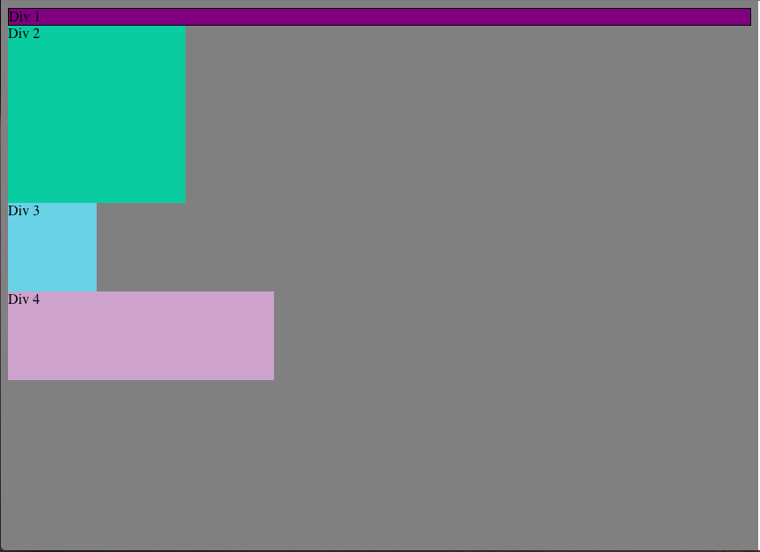
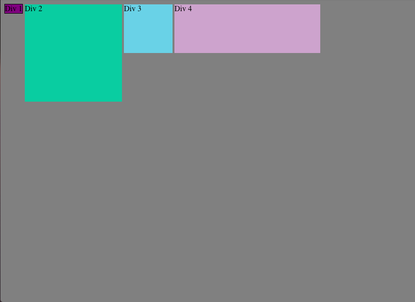
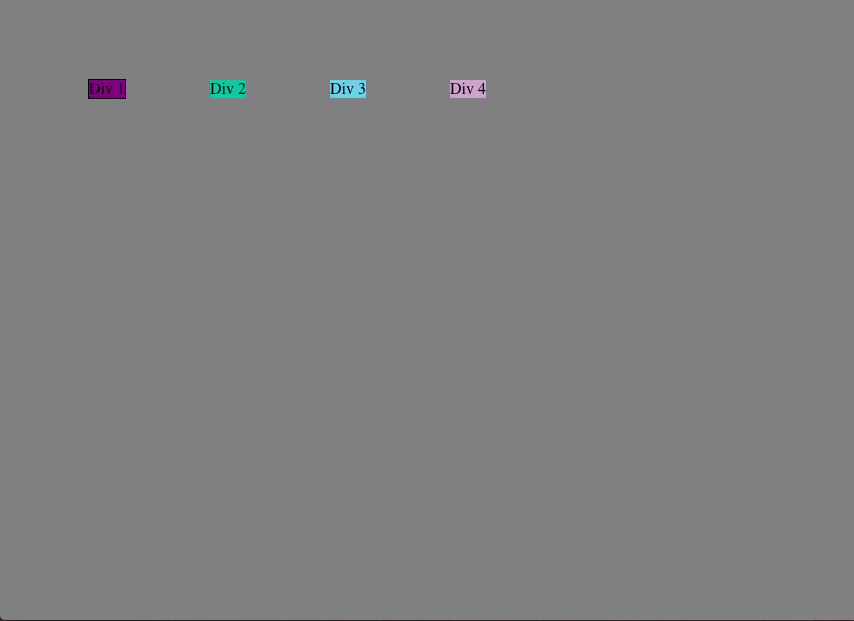
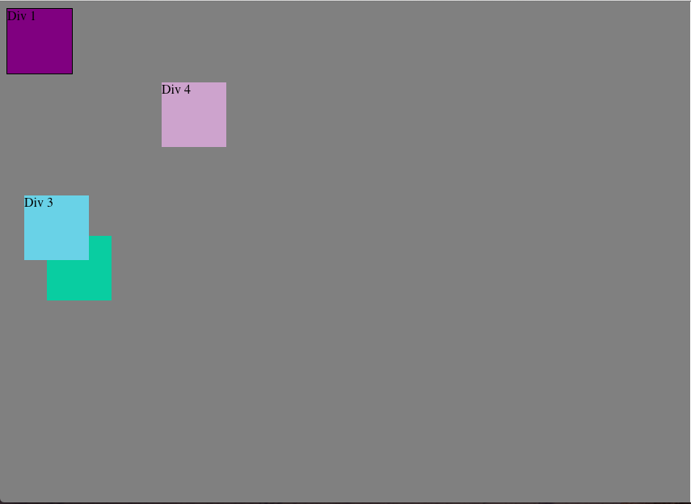
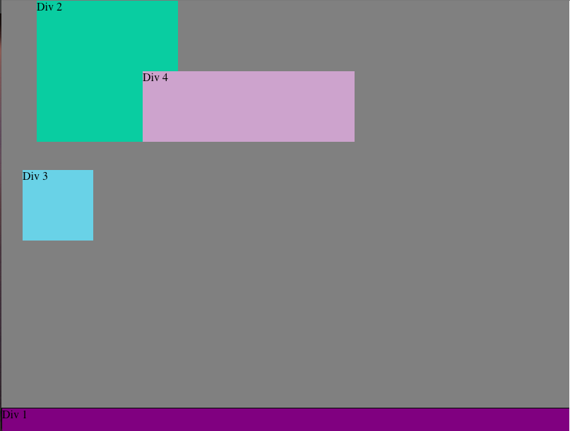
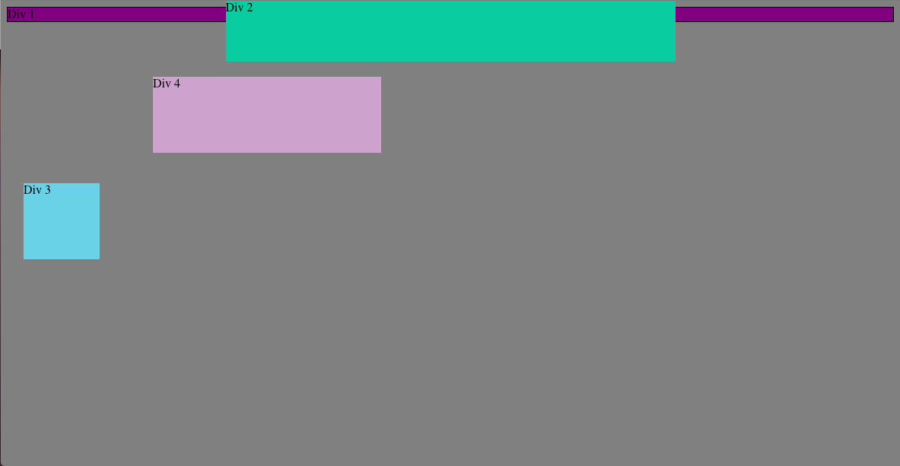
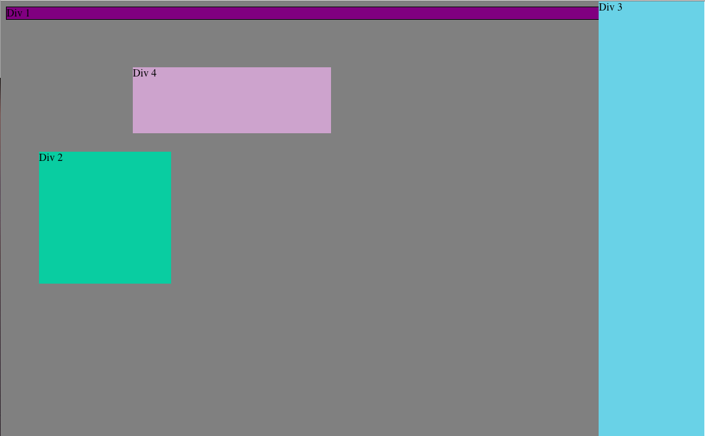
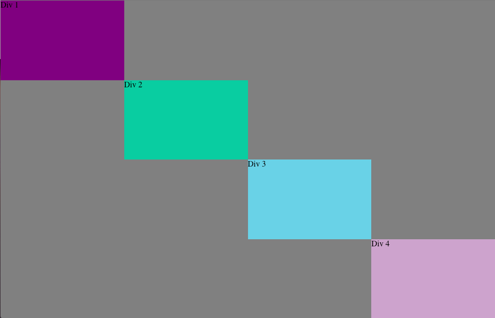

#How can you use Chrome's DevTools inspector to help you format or position elements?

Chrome's Devtools give you an easy way to view the DOM and often give a graphic representation of margins and borders which allow one to quickly view the properties of individual elements in the stylesheet. Values for positioning are easily editable and testable in a nondestructive way.

#How can you resize elements on the DOM using CSS?

Resizing elements on the DOM is best accomplished by viewing the element in Developer Tools and editing the height and width properties.

#What are the differences between absolute, fixed, static, and relative positioning? Which did you find easiest to use? Which was most difficult?

Static positioning is the default positioning for elements. They are positioned as they would be in the normal document flow. Fixed positioned elements are positioned relative to the browser window. Relative positioned elements are positioned relative to where they would appear were they statically positioned. Absolute positioned elements are positioned relative to the first non-statically positioned ancestor element. I found fixed positioning to be the easiest to use because it allows one to use the browser window as a kind of coordinate-space within which you can position elements. This was useful for positioning things relative to the perceived "borders" of the page. I found absolute positioning most difficult to use because it relied on knowledge of the positioning of the parent element to make use of effectively and did not feel "self contained".

#What are the differences between margin, border, and padding?

Margin, border, and padding all encompass the content but move from outermost to innermost. Immediately outside the content is the padding area, followed by the border area as we continue outwards, followed by the margin going out further still. Padding is affected by background-color and thus is used to create whitespace around content, borders are used for visually delimiting sections around content, and margins are used for creating whitespace outside the border.

#What was your impression of this challenge overall? (love, hate, and why?)

Although I enjoyed the challenges and often found them intriguingly counterintuitive, I ultimately found much of this challenge to be fairly frustrating. I found the interdependence of elements that don't appear to share any reason for a relationship to be extremely confusing and frustrating - adjust the positioning of one element only to have other exhibit surprising behavior. I started to begin "thinking in CSS" roughly halfway through the challenges but I often felt my solutions to be hacky or cobbled together. I found the problem solving process to be very much "guess and check" while I typically like to pseudocode or think about a solution before I begin writing anything. I suppose I will have to work to a bit harder than expected to develop a predictive sense of CSS.
