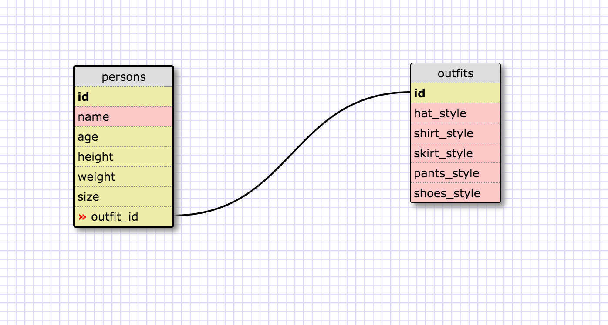

# What are databases for?

Databases are used for storing information in a relational way. Databases are more scalable and more easily accessed than the built-in data sturctures provided within languages. Databses are able to establish relationships between rows from different tables and with SQL it is possible to access data from multiple tables easily.

# What is a one-to-many relationship?

A one-to-many relationship is a type of data relationship where a single row in one table is associated with multiple rows in another table. For example, if we had a table for students in DBC and another table for computers. Each row in the computer table (eg, Apple, OSX, 10.11.2, 2015) may be associated with multiple students, but (for the purposes of the example) each student only has one computer configuration. Rather than add tons of extra columns to the students table such as brand, os, os version, year purchased, we simply associate complete configuration to a student with an id from the computer table.

# What is a primary key? What is a foreign key? How can you determine which is which?

A primary key is a unique id associated with each row in a table used to identify that row. A foreign key is a column or combination of columns that establishes a link between two tables. The foreign key from one table connects to the primary key in another table, thus establishing a referential link. One way to determine whether a key is primary or foreign is to examine uniqueness. The primary key must be unique for each row while a foreign key is often repeated as this implies a one-to-many relationship between the tables. Also, a table can only have one primary key, although this primary key can be comprised of multiple columns.

# How can you select information out of a SQL database? What are some general guidelines for that?

Selecting information from a SQL database begins with a SELECT query, followed by the column, columns or wildcard of columns one wishes to select, this is followed by FROM, which is in turn followed by the table one is querying. Additional information may be provided such as "ORDER BY column ASC/DESC" which will sort the results table by a particular column in an ascending or descending way. Conditional statements in the form of WHERE and IN can also be provided to display information on a conditional basis.

