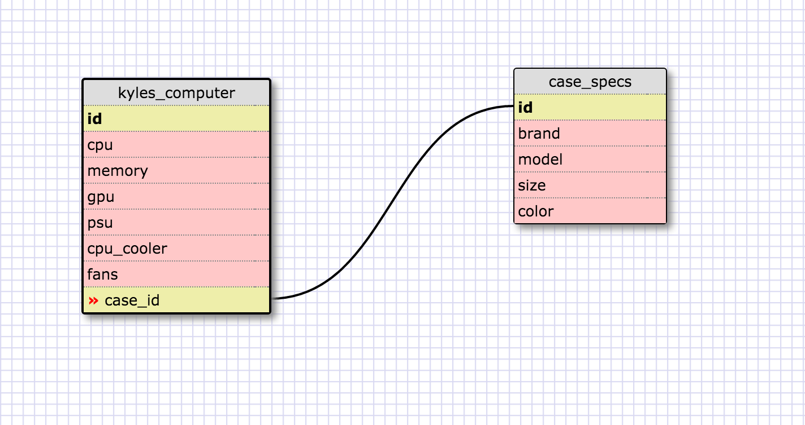
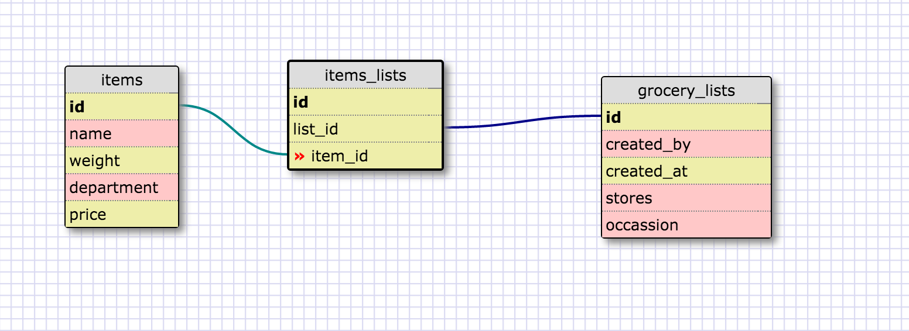

# What is a one-to-one database?

A one-to-one database is used when two items have a singular relationship with each other. They are best thought of as a pair. They are used when a group of fields in one of the tables can be left as NULL.

# When would you use a one-to-one database? (Think generally, not in terms of the example you created).

A one-to-one database is best used when two items are linked to each other in a singular way. One thing is associated with another thing and only that thing and vice versa. If one of the tables potentially contains a good number of NULL values, it is a good indicator that a one-to-one database should be used.

# What is a many-to-many database?

A many-to-many database is a database where a row is potentially associated with a number of other rows and vice-versa. There are a multitude of associations between multiple tables.

# When would you use a many-to-many database? (Think generally, not in terms of the example you created).

A many-to-many database is a database where a row in a table is associated with multiple other rows in another database and vice-versa. Many-to-many databases are best used when there are multiple associations between two tables where each row in each table can be associated with a number of rows in the other table.

# What is confusing about database schemas? What makes sense?

Database schemas are not overly confusing however having to explain their function in english makes for an awkward exercise. I understand the different kinds of relationships and it is not difficult to think of examples where each of them would be put to use however manipulating join tables is still somewhat foreign to me.